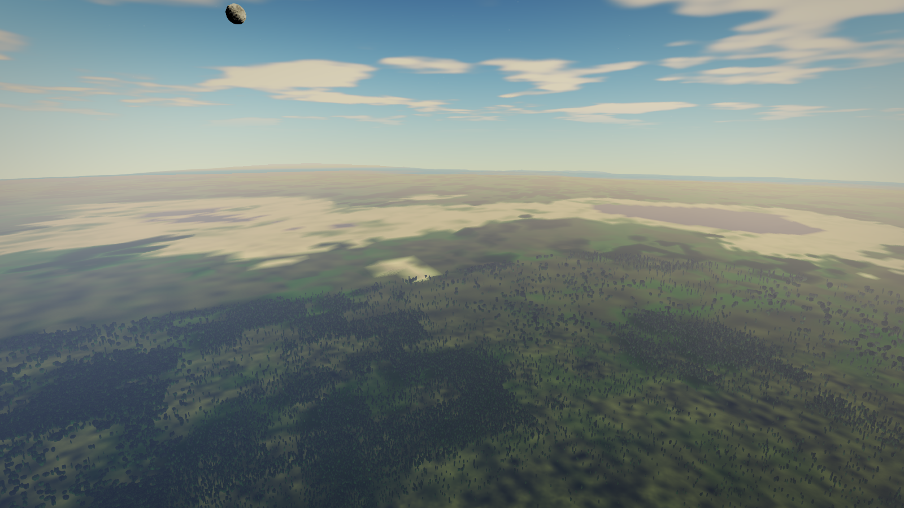
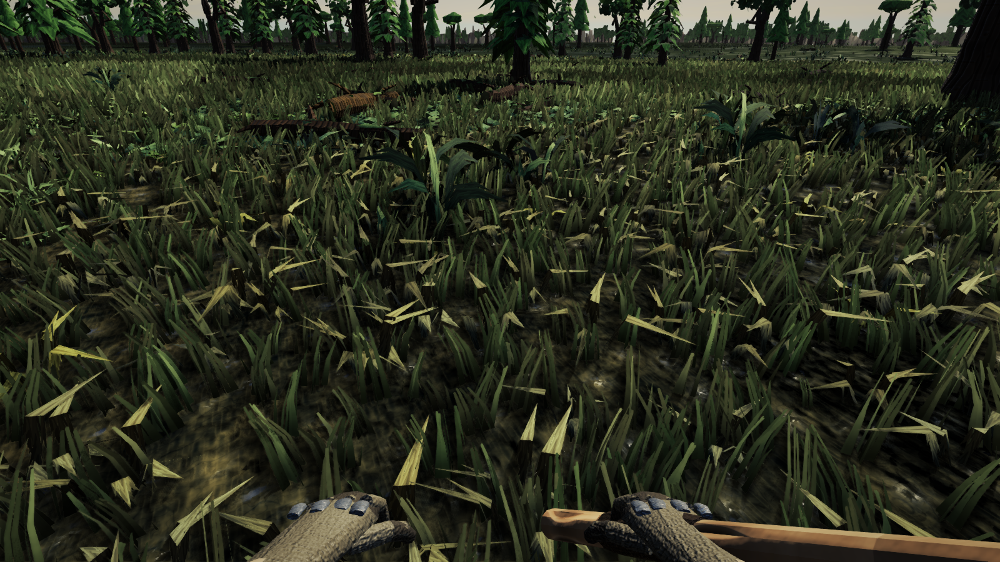
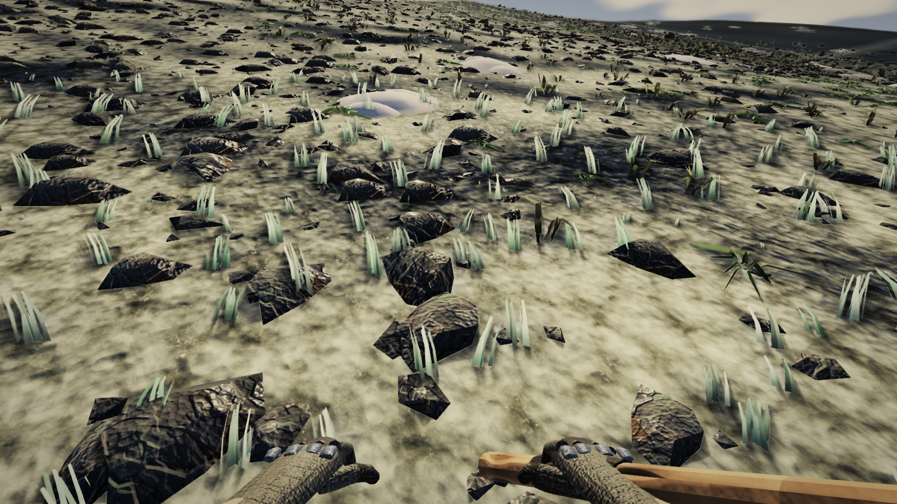
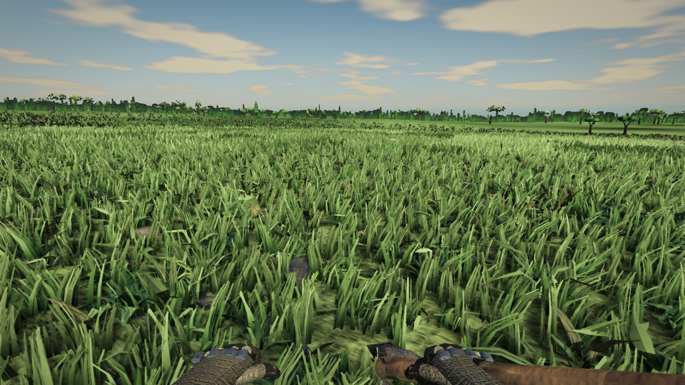
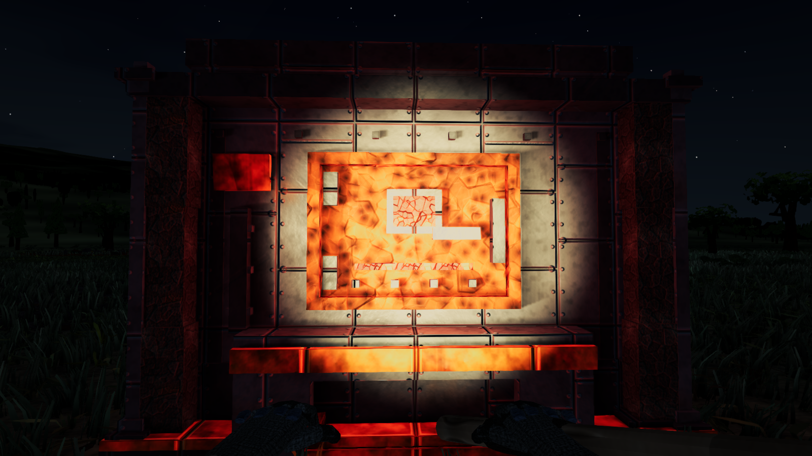
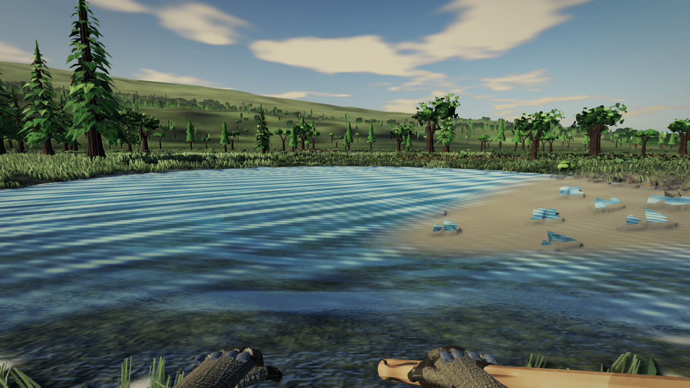

# THE SPACE ENGINEERS REFERENCE BOARD

**Status:** Scaffolded, empty slots await Reid. **Owner:** rendering-controller. **Last updated:** 2026-08-23.
**Lane:** `lane/se-board`, RN-2715 (RN-2716 to RN-2719 surrendered unused, see NUMBERS.md rule 4).
**Reads:** [FIDELITY-GAP-2026-08-19.md](../../web/FIDELITY-GAP-2026-08-19.md) (the hero-frame process and the SE bar),
[WORLD-AUDIT-R6-2026-08-23.md](../../web/WORLD-AUDIT-R6-2026-08-23.md) (the current ranked gaps),
and [rendering.md](../../controllers/rendering.md) sections 2.44 to 2.49 (what has landed since R6).

## How to use this board

Six sections below, one per hero-frame category from FIDELITY-GAP §3's process (Option D). Each section
has three parts:

1. **The current frame.** The strongest existing capture under `docs/screenshots/`, embedded inline. No new
   captures were taken for this board; everything here already existed before this lane started.
2. **The honest read.** One paragraph on where that frame stands against the SE bar, quoting the audit
   rather than re-arguing it.
3. **An empty reference slot.** A named target file under `docs/reference/SE/` and exactly what to capture
   in Space Engineers to fill it: scene type, time of day, camera altitude and angle, and what the
   comparison is meant to judge. Save your SE screenshot to the named path and the pairing becomes
   drag-and-drop; nothing else on this page needs to change.

This board does not judge SE. It exists so a side-by-side can happen at all, since nobody but Reid can
supply the other half of the pair. Once slots are filled, whichever lane next touches a category should
place the SE shot beside the current frame and write the comparison paragraph FIDELITY-GAP's Option D
process calls for, in that lane's own report rather than by editing this scaffold.

---

## 1. Aerial forest



`docs/screenshots/R6_forestair.png` (`audit/r6`, 2026-08-23). 1,200 m eye, pitch -14, `flyover`'s pose
over forest ground (`web/tools/smoke/probes/artframe.js`, the `forestair` shot).

**The honest read.** This was World Audit R6's rank 1 before the correction pass moved it off the top
of the list: "at `flyover` the ground from 1.7 km to 4.5 km carries 6.3 to 18.9 counts of coarse lateral
structure and from 4.5 km to 15.2 km it carries 2.1 to 2.3, and the missing structure is not missing:
turning the aerosol off on the same rectangle returns 7.07 against the shipped 2.24 at a 32 px filter,
so the atmosphere is removing 68 per cent of what the geometry already draws over two thirds of the
visible depth" (WORLD-AUDIT-R6 §0, §4.1). The geometry is there; the haze is eating it on purpose, by an
authored constant that measures close to its own design value (rendering.md 2.46.2). This has since been
reclassed as a Reid look decision rather than a lane dispatch (rendering.md 2.46.8, 2.46.1 item 1): a
quarter off the amplitude buys back 26 per cent of the structure, a half buys 68 per cent. Nothing has
shipped since R6 that changes what this frame shows.

**EMPTY REFERENCE SLOT.**

```
Target: docs/reference/SE/aerial_forest.png
Scene:  a densely forested planet/moon surface in SE, shot from a ship or jetpack at roughly
        1,000 to 1,500 m altitude, nose pitched down about 10 to 15 degrees so the horizon sits
        in the upper third of the frame (matching R6_forestair.png's framing).
Time:   full daylight, sun reasonably high, some cloud cover if SE's sky supports it.
Judges: how far SE's haze/atmosphere lets mid-to-far terrain structure read before the sky takes
        over, versus our aerosol curve eating two-thirds of the visible depth. This is the
        Reid-decision pairing for the aerosol amplitude call.
```

---

## 2. Ground-level forest / understorey



`docs/screenshots/RN2450_forestfloor.png` (2026-08-21). Standing eye, pitch -26, closed canopy, litter
ground (`forestfloor`, the RN-352 site FIDELITY-GAP's own calibration row is taken on).

**The honest read.** FIDELITY-GAP's own asset-ceiling item names this frame's ceiling directly: "Individual
SE grass blades and trees are unremarkable, but they are dense, soft-shaded, translucent-looking and
colour-coordinated. Our props are chunky low-poly with hard facet shading and no translucency
approximation (the whole conifer is 791 triangles at LOD0; the ceiling study proved triangles are not
what we are short of). Better lighting cannot rescue chunky source geometry; this is an asset ceiling,
not a shader ceiling" (FIDELITY-GAP-2026-08-19.md §1 item 5). None of the lanes recorded in rendering.md
2.44 to 2.49 touched vegetation mesh fidelity (they worked the far paint, the canopy pool ceiling, the
world audit itself, the emissive ground share, and the snow patch); this frame's own litter tint was
separately noted as untouched across lanes ("`RN2285_forestfloor.png` and `RN2365_forestfloor.png` at 3x
are nearly the same picture", rendering.md line 7220). The gap here is still open and undispatched.

**EMPTY REFERENCE SLOT.**

```
Target: docs/reference/SE/forest_understorey.png
Scene:  standing inside a dense tree stand in SE (or the closest analogue SE has, e.g. a forest
        biome mod, or omit if SE has none and note that in a comment here), eye height around
        1.6 to 2 m, pitched down 20 to 30 degrees so canopy and litter/ground both fill most of
        the frame, matching RN2450_forestfloor.png's framing.
Time:   daylight, dappled shade under canopy preferred.
Judges: vegetation asset fidelity at close range: blade/leaf density, translucency, soft shading
        versus our chunky low-poly, hard-faceted look. If SE has no forest interior to shoot, use
        its densest foliage scene instead and say so in place of this slot.
```

---

## 3. Mountains + snow



`docs/screenshots/RN2700_mtnslope_head_r1.png` (`lane/n18-snow`, 2026-08-23). Standing eye, pitch -8,
facing uphill on the steep substrate (`mtnslope`), captured after the landed snow-patch fix.

**The honest read.** R6 found the snow patch a "faceted plastic slab... the highest-contrast near-field
object in `vista`, `vistadawn` and `mtnslope`" with "a 46.2-count inversion at one row under one light"
(rendering.md 2.46.5), the audit's own rank-1 bug (WORLD-AUDIT-R6 §4.3, reclassed to first priority by
the correction pass, rendering.md 2.46.8). `lane/n18-snow` landed a real fix the same day: the mesh
became a drift instead of a slab, and the material moved off the `flat` `Ice` family onto `Snow`, taking
the shaded-facet-to-substrate inversion from 46.21 counts down to 22.33, "77 per cent gone" on the
patch's own internal hue swing (rendering.md 2.48.1, 2.48.3). This is the one category on this board that
is *partially closed*, not open: the fix measurably improved the object, and a residual 22-count warm
gap remains. A side-by-side against SE tells us whether that residual is still visible by eye or has
dropped below the threshold that matters.

**EMPTY REFERENCE SLOT.**

```
Target: docs/reference/SE/mountain_snow.png
Scene:  a rocky/snowy slope in SE, standing eye, facing uphill so the slope substrate fills most
        of the lower frame with a snow patch or snow-covered terrain feature in the near field,
        matching RN2700_mtnslope_head_r1.png's framing (pitch roughly -8, i.e. looking slightly
        downhill from a standing eye on an uphill-facing stance).
Time:   daylight with a clear directional sun, so shaded versus sunlit snow facets are both visible.
Judges: whether SE's snow material reads as snow (soft, matte, ambient-lit) in both sun and shade,
        against our post-fix drift, which still carries a measured 22-count warm/cool split between
        its lit and shaded facets.
```

---

## 4. Plains / meadow horizon



`docs/screenshots/R6_meadowfield.png` (`audit/r6`, 2026-08-23). Standing eye, pitch -12, yaw 150, the
plains hero pose FIDELITY-GAP's meadow reference frame is taken from (`meadowfield`).

**The honest read.** This is literally the frame FIDELITY-GAP's Reid-supplied comparison started from
("Reid's meadow frame ... against the Space Engineers alpha 11/2015 grassland shot", FIDELITY-GAP-2026-08-19.md
header), so it is the single most direct pairing on this whole board. R6 found the pose itself cannot
settle the eye's oldest complaint about it: "the whole 84 m-to-horizon band occupies about twelve frame
rows. A wide-x row profile flattens the eye's apparent carpet cut to a 3.54-count maximum step ... The
claim that the carpet ends in a ruler-straight cut is struck on this measurement ... `midfield` is the
precedent ... and Plains has no twin; `midfield` declares `props: false` and cannot judge a carpet"
(rendering.md 2.46.4, WORLD-AUDIT-R6 §4.5). Ranked fourth in the adopted re-ranking (rendering.md 2.46.8)
and not yet dispatched to a lane. FIDELITY-GAP's five systems (carpet, materials, sky, grading, assets)
all bear on this one frame at once, which is why it was chosen as the reference pair originally.

**EMPTY REFERENCE SLOT.**

```
Target: docs/reference/SE/plains_meadow.png
Scene:  open grassland in SE with a treeline or horizon feature in the distance, standing eye,
        pitched down 10 to 15 degrees so grass fills the lower half and the treeline sits roughly
        a third of the way up the frame, matching R6_meadowfield.png's framing.
Time:   daylight, ideally the same kind of overcast-to-partly-cloudy sky as R6_meadowfield.png so
        sky-to-ground balance is comparable.
Judges: the five-systems gap FIDELITY-GAP names together (ground-as-material vs ground-with-clumps,
        textured terrain vs palette, sky as light source vs backdrop, colour grading vs raw ACES,
        and vegetation asset fidelity). This is the master pairing; treat it as the one to look at
        first once filled.
```

---

## 5. Night / emissive



`docs/screenshots/RN2710_smelternight_shipped.png` (`lane/n19-emitground`, 2026-08-23). Standing
standoff distance, night, the smelter's forge lit (`smelternight`).

**The honest read.** R6 first read this frame as a bug: "the smelter at night is finally beautiful and
lights nothing" (rendering.md 2.46.5), reasoning from twelve committed rectangles that turned out to be
"entirely machine surface... a switch that cannot reach a rectangle's pixels cannot move that rectangle"
(rendering.md 2.47). `lane/n19-emitground` added two real ground rectangles and found the emitter's
ground share is real, just small and previously unmeasured: shipped against `?firelightground=0` moves
`groundL` by -6.7 per cent and `groundR` by -10.6 per cent (rendering.md 2.47, table under "(b) A REAL
GROUND RECTANGLE, ADDED, MOVES"). So the finding flipped from "broken" to "real but modest, and it was
never provably zero", which is a measurement correction, not yet a visual fix; whether the glow reads as
touching the ground by eye, next to an SE forge or lit structure at night, is exactly what an instrument
cannot settle and this pairing can.

**EMPTY REFERENCE SLOT.**

```
Target: docs/reference/SE/night_emissive.png
Scene:  a lit structure or light source in SE at night, e.g. a refinery/furnace block, an interior
        light spilling outward, or a ship's running lights against dark terrain. Standing distance
        similar to a normal walking view, facing the light source roughly head-on.
Time:   night, stars or a dark sky visible, matching RN2710_smelternight_shipped.png's darkness level.
Judges: whether SE's emissive light visibly colours and lights the ground/surroundings near the
        source, versus ours, which is real but small (-6.7 to -10.6 per cent on the nearest grass
        rectangles) and was mistaken for zero for five audit rounds running.
```

---

## 6. Water / coast



`docs/screenshots/RN2700_pondside_head.png` (`lane/n18-snow`, 2026-08-23, captured as a regression
control alongside that lane's snow work). Standing eye, pitch -8, yaw 180, the only standing water
surface in the hero-pose set (`pondside`).

**The honest read.** This category has stood still since Round 4: "Water is a regular corrugation that
reflects nothing: parallel diagonal stripes at one period and one amplitude across the whole surface, no
reflection of the far bank, the sky or the sun, no fresnel, and hard-edged blue polygon flakes lying on
the sand at the shore. Unmoved since R4 ranked it" (rendering.md line 686, WORLD-AUDIT-R6 §8, classed
"CLEARLY BEHIND"). It sits beside, but is a separate finding from, the beach's treeless-disc rank 2
("survives untouched on the new instrument... stays Reid-blocked" on the Ocean/Beach coastline identity
decision, WORLD-AUDIT-R6 §0). No lane has been dispatched against the water shader itself since Round 4;
it is open and undispatched, not blocked on a Reid decision the way the beach disc is.

**EMPTY REFERENCE SLOT.**

```
Target: docs/reference/SE/water_coast.png
Scene:  a lake, sea, or coastline in SE with a visible far shore or horizon across the water,
        standing eye, pitched down slightly (roughly -8 degrees) so the water fills the lower half
        and the far bank/treeline sits near the middle of the frame, matching
        RN2700_pondside_head.png's framing.
Time:   daylight with enough sun angle to see specular highlights or reflections on the water.
Judges: reflection and fresnel behaviour (sky, far bank, sun glints) versus our flat, one-period
        diagonal-stripe corrugation with no reflection of anything and hard-edged shoreline
        artifacts, unmoved since Round 4 of the audit.
```

---

## Filling the slots

Drop each SE screenshot into its named path above (`docs/reference/SE/<name>.png`). Once a slot has a
file, whichever lane next works that category should place the pair side by side in its own report and
answer FIDELITY-GAP's Option D question directly: which numbered differences from FIDELITY-GAP §1 does
the current frame close, partially close, or not touch, against this specific SE reference. This board
does not need to be edited to add that answer; it belongs in that lane's own report and, if durable, in
rendering.md.
